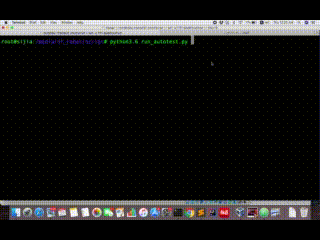

# webautomation-robot-docker
create a web autotest framework with docker-selenium and robotframework
## Setup Environment
1. run `sudo bash ./script/host_setup.sh` on host to
    - install docker and docker-compose
    - install python and dependencies
2. fill in properties file `./conf/main.properties`

## How to run
run `python3.6 ./script/run_autotest.py`

it will create three docker containers

1. **robot**: based on a [python3.6-apline](https://github.com/docker-library/python/tree/0b1fb9529c79ea85b8c80ff3dd85a32a935b0346/3.6/alpine3.10) docker image for running all the test cases written by robotframework and python
2. **se-node-ch**: using [selenium/node-chrome-debug](https://github.com/SeleniumHQ/docker-selenium/tree/master/StandaloneChromeDebug) image. docker-selenium node with chrome installed, needs to be connected to a grid hub. It has VNC installed which can be used as an debug method. You can access the UI using docker private ip and password is `secret`. 
3. **se-hub**: [selenium grid hub](https://github.com/SeleniumHQ/docker-selenium/tree/master/Hub) image

## Code Demo
Here is the demo

## Code Structure 
The robot docker container (under `./docker/robot`) is running robot framework tests:
- `conf/`: contains robotFramework arguments, test cases variables
- `lib/`: all python code, low level keywords implementation
    - `pages/`: low level python keywords implemented for each web page.
- `res/`: robot resource files. intermediate level keywords.
- `test/`: all test cases written in robot.
- `script/`: start point to run tests

## Libraries 
required libraries under `./docker/robot/conf/requirements.txt`
- [robot framework](https://github.com/robotframework/robotframework)
- [PageObjectLibrary](https://github.com/boakley/robotframework-pageobjectlibrary)
- [SeleniumLibrary](https://github.com/robotframework/SeleniumLibrary)

## Test Website
Test Cases are created to test the sample ecommerce website
http://automationpractice.com/index.php
